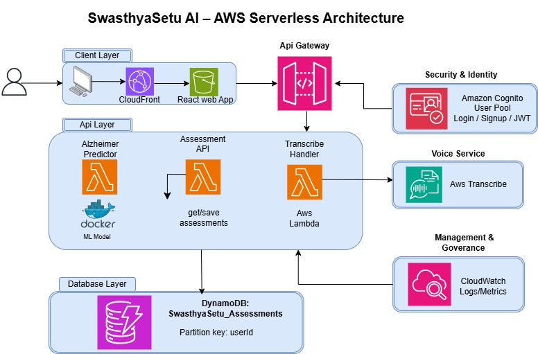

# SwasthyaSetu AI

>AI-Powered Healthcare Diagnostic Platform for Rural India

SwasthyaSetu AI is a cloud-native, serverless healthcare diagnostic platform that leverages AWS services and artificial intelligence to provide accessible disease screening for rural and underserved populations in India. The platform removes literacy, language, and technology barriers through Voice-In/Voice-Out interaction in Hindi and English.


## 🎯 Problem Statement

Rural India faces a critical healthcare accessibility crisis:

- **Literacy Barriers**: Over 30% of rural population has limited literacy, making text-based healthcare apps inaccessible
- **Language Barriers**: Most healthcare platforms are English-only, excluding Hindi and regional language speakers
- **Technology Barriers**: Complex interfaces and high-bandwidth requirements prevent adoption in areas with poor connectivity
- **Healthcare Access**: Limited access to diagnostic facilities and trained medical professionals in remote areas
- **Early Detection Gap**: Lack of early screening for critical diseases like Tuberculosis, Pneumonia, and Alzheimer's leads to late-stage diagnosis

These barriers result in delayed diagnosis, preventable deaths, and increased healthcare costs for vulnerable populations.


## 💡 Our Solution

SwasthyaSetu AI addresses these challenges through:

### 🤖 AI-Powered Diagnostics
- Chest X-ray analysis for TB and Pneumonia detection (94%+ accuracy)
- Cognitive assessment for Alzheimer's risk evaluation
- Multi-disease screening with confidence scoring
- Real-time risk assessment and recommendations

### 📱 Low-Bandwidth Optimization
- Works on 2G/3G networks
- Automatic bandwidth detection and adaptation
- Audio compression to 32 kbps without quality loss
- Image compression while preserving diagnostic quality
- Response times under 10 seconds even on slow networks

### 🏥 Healthcare Integration
- Locates nearest Public Health Centers within 50km
- Voice-guided navigation in local languages
- Automatic urgent care recommendations
- Telemedicine options for remote areas

### 📊 Comprehensive Reporting
- Simple, non-technical language reports
- Risk scores with confidence levels
- Actionable recommendations
- Bilingual report generation (Hindi/English)


## 🏗️ AWS Serverless Architecture



### Architecture Overview

The platform follows a layered serverless architecture built entirely on AWS services:

#### **Client Layer**
- React web application hosted on Amazon S3
- Voice-enabled interface optimized for low-bandwidth
- Progressive Web App (PWA) capabilities for offline support

#### **API Gateway Layer**
- Amazon API Gateway for RESTful endpoints
- Request validation and rate limiting
- CORS configuration for secure cross-origin requests

#### **Security & Identity**
- Amazon Cognito User Pool for authentication
- JWT token-based authorization
- Multi-factor authentication support
- Role-based access control (RBAC)

#### **Compute Layer (AWS Lambda)**
- **Disease Predictor**: XGBoost-based symptom analysis with multi-metric evaluation (Accuracy, Precision, Recall, F1-Score)
- **Alzheimer Predictor**: Cognitive assessment processing with ML model inference
- **Assessment API**: Get/save patient assessments and diagnostic records
- **Transcribe Handler**: Voice-to-text and text-to-voice processing

#### **Voice Services**
- Amazon Transcribe for speech-to-text (Hindi & English)
- Real-time audio streaming with low latency
- Custom medical vocabulary for improved accuracy

#### **Database Layer**
- DynamoDB table: `SwasthyaSetu_Assessments`
- Partition key: `userId` for efficient user-based queries
- Serverless scaling with on-demand capacity
- Point-in-time recovery enabled

#### **Management & Governance**
- Amazon CloudWatch for logs and metrics
- Real-time monitoring and alerting
- Performance tracking and optimization
- Cost monitoring and budget alerts

### Key Architecture Benefits

- **Serverless**: Zero server management, automatic scaling
- **Cost-Effective**: Pay only for actual usage
- **Highly Available**: Multi-AZ deployment with 99.9% uptime
- **Secure**: End-to-end encryption, compliance-ready
- **Scalable**: Handles 10,000+ requests per hour automatically
- **Low Latency**: Edge locations for global performance


## 🚀 Features

### Core Capabilities

- **Multi-Disease Screening**
  - Tuberculosis detection from chest X-rays
  - Pneumonia identification
  - Alzheimer's risk assessment through cognitive tests

- **Voice Processing**
  - Real-time speech recognition (95% accuracy)
  - Natural text-to-speech synthesis
  - Automatic language detection
  - Medical terminology simplification

- **Intelligent Diagnostics**
  - XGBoost predictive model for symptom-based screening
  - Deep learning models (EfficientNetB4 architecture) for image analysis
  - Model evaluation using Accuracy, Precision, Recall, F1-Score, and ROC curves
  - Confidence scoring (0-100%) with Confusion Matrix validation
  - Differential diagnosis for overlapping symptoms
  - Image quality validation

- **PHC Locator**
  - 50km radius facility search
  - Distance calculation and navigation
  - Real-time availability checking
  - Emergency facility recommendations

- **Security & Privacy**
  - HIPAA-aligned data handling
  - AES-256 encryption at rest
  - TLS 1.3 encryption in transit
  - GDPR compliance (right to erasure)
  - Comprehensive audit logging


## 🛠️ Technology Stack

### Frontend
- **Framework**: React 18.3
- **Routing**: React Router DOM 7.13
- **Styling**: Tailwind CSS 3.4
- **Animations**: Framer Motion 12.34
- **Icons**: Lucide React
- **Build Tool**: Vite 7.3

### Backend (AWS Services)
- **Compute**: AWS Lambda (Node.js/Python)
- **API**: Amazon API Gateway
- **Authentication**: Amazon Cognito
- **Database**: Amazon DynamoDB
- **Storage**: Amazon S3
- **Voice**: Amazon Transcribe & Polly
- **AI/ML**: XGBoost model deployed on Lambda
- **Monitoring**: Amazon CloudWatch

### AI/ML
- **Primary Model**: XGBoost (Extreme Gradient Boosting)
- **Data Processing**: Preprocessed and balanced dataset with 80:20 train-test split

- **Deep Learning**: EfficientNetB4 architecture for chest X-ray analysis
- **Deployment**: AWS Lambda for model inference


## 📦 Installation & Setup

### Prerequisites
- Node.js 18+ and npm
- AWS Account with appropriate permissions
- AWS CLI configured

### Local Development

1. **Clone the repository**
```bash
git clone https://github.com/yourusername/swasthyasetu-ai.git
cd swasthyasetu-ai
```

2. **Install dependencies**
```bash
npm install
```

3. **Configure environment variables**
```bash
cp .env.example .env.production
```

Edit `.env.production` with your AWS credentials:
```env
VITE_AWS_REGION=your-region
VITE_COGNITO_USER_POOL_ID=your-user-pool-id
VITE_COGNITO_CLIENT_ID=your-client-id
VITE_API_GATEWAY_URL=your-api-gateway-url
```

4. **Start development server**
```bash
npm run dev
```

5. **Build for production**
```bash
npm run build
```

### AWS Deployment

1. **Deploy Lambda functions**
```bash
cd lambda
./deploy.sh
```

2. **Configure API Gateway**
- Import OpenAPI specification
- Configure CORS and authentication
- Deploy to production stage

3. **Deploy frontend to S3**
```bash
npm run build
aws s3 sync dist/ s3://your-bucket-name --delete
```

4. **Configure CloudFront** (optional)
- Create distribution pointing to S3 bucket


## 📱 Usage

### For Patients

1. **Register/Login**: Create account or sign in using phone/email
2. **Select Language**: Choose Hindi or English
3. **Choose Screening**: Select disease type (TB, Pneumonia, Alzheimer's)
4. **Voice Interaction**: Speak symptoms or upload medical images
5. **Get Results**: Receive AI-powered risk assessment
6. **Find Healthcare**: Locate nearby PHCs with navigation

### For Healthcare Workers

1. **Batch Screening**: Process multiple patients efficiently
2. **Review History**: Access patient diagnostic history
3. **Generate Reports**: Create comprehensive diagnostic reports
4. **Refer Patients**: Direct high-risk patients to appropriate facilities


## 🔒 Security & Compliance

- **Encryption**: AES-256 (at rest), TLS 1.3 (in transit)
- **Authentication**: Multi-factor authentication via Cognito
- **Authorization**: JWT tokens with role-based access
- **Privacy**: GDPR and HIPAA-aligned practices
- **Audit**: Comprehensive logging via CloudWatch
- **Data Retention**: Configurable with automatic deletion
- **Vulnerability Scanning**: Automated security scanning


## 🌍 Supported Languages

- English
- 🇮🇳 Hindi (हिन्दी)
- 🇮🇳 Tamil (தமிழ்)
- 🇮🇳 Urdu (اردو)
- 🇮🇳 Gujarati (ગુજરાતી)

## 🗺️ Roadmap

### Phase 1 (Current)
- ✅ Voice-first interface (Hindi/English)
- ✅ TB and Pneumonia detection
- ✅ Alzheimer's risk assessment
- ✅ PHC locator
- ✅ Low-bandwidth optimization

### Phase 2 (Q2 2026)
- 🔄 Additional regional languages (Tamil, Telugu, Bengali)
- 🔄 Diabetes screening
- 🔄 Cardiovascular risk assessment
- 🔄 Telemedicine integration

### Phase 3 (Q4 2026)
- 📋 Electronic Health Records (EHR) integration
- 📋 Prescription management
- 📋 Appointment scheduling
- 📋 Health insurance integration


### Development Workflow
---
1. Fork the repository
2. Create a feature branch (`git checkout -b feature/amazing-feature`)
3. Commit changes (`git commit -m 'Add amazing feature'`)
4. Push to branch (`git push origin feature/amazing-feature`)
5. Open a Pull Request

## 👥 Team

- Dev Dobariya
- Vency Thummar
- Parth Gurlani
- krina Senjaliya 


## 📞 Support
- **Email**: devdobariya75@gmail.com


## 🙏 Acknowledgments

- AWS for cloud infrastructure and AI services
- Medical institutions for training data and validation
- Rural healthcare workers for feedback and testing
- Open-source community for tools and libraries


## ⚠️ Disclaimer

SwasthyaSetu AI is a screening tool and should not replace professional medical diagnosis. Always consult qualified healthcare professionals for medical advice, diagnosis, and treatment.

