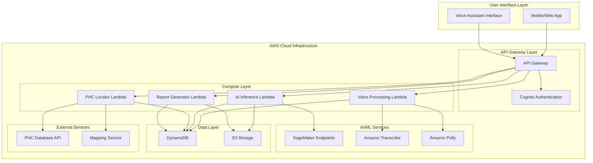

# SwasthyaSetu AI - Design Document

## Overview

SwasthyaSetu AI is architected as a cloud-native, serverless healthcare diagnostic platform that leverages AWS services to provide voice-first, AI-powered disease screening for rural India. The system follows a microservices architecture with event-driven communication patterns, optimized for low-bandwidth environments while maintaining high scalability and reliability.

The platform integrates three core capabilities: AI-powered medical image analysis using deep learning models, multilingual voice processing for Hindi and English interactions, and intelligent Public Health Center location services. The architecture emphasizes serverless computing to minimize operational overhead while ensuring automatic scaling based on demand.

## Architecture

### High-Level Architecture

The system follows a layered serverless architecture with clear separation of concerns:

**Presentation Layer**: Voice-enabled mobile/web interface optimized for low-bandwidth networks
**API Layer**: Amazon API Gateway providing RESTful endpoints with authentication and rate limiting
**Compute Layer**: AWS Lambda functions handling business logic, AI inference, and data processing
**AI/ML Layer**: Amazon SageMaker for model hosting and inference, with custom models for disease detection
**Data Layer**: Amazon DynamoDB for structured data, S3 for medical images and audio files
**Integration Layer**: AWS services for voice processing (Transcribe/Polly), authentication (Cognito), and monitoring

### System Architecture Diagram Description



## Components and Interfaces

### Voice Processing Component

**Purpose**: Handles speech-to-text and text-to-speech operations with multilingual support
**Technology**: Amazon Transcribe, Amazon Polly, AWS Lambda
**Key Features**:
- Real-time speech recognition with 95% accuracy for Hindi and English
- Audio compression for low-bandwidth optimization (32 kbps)
- Regional dialect recognition and cultural context processing
- Automatic language detection and seamless switching

**Interface Specification**:
```typescript
interface VoiceProcessor {
  transcribeAudio(audioData: Buffer, language: 'hi' | 'en'): Promise<TranscriptionResult>
  synthesizeSpeech(text: string, language: 'hi' | 'en', voice: VoiceId): Promise<AudioBuffer>
  detectLanguage(audioData: Buffer): Promise<LanguageCode>
  compressAudio(audioData: Buffer, targetBitrate: number): Promise<Buffer>
}
```

### AI Diagnostic Engine

**Purpose**: Performs medical image analysis and disease risk assessment
**Technology**: Amazon SageMaker, TensorFlow/Keras, Custom CNN models
**Supported Models**:
- Chest X-ray analysis for TB and Pneumonia detection (EfficientNetB4 architecture)
- Cognitive assessment processing for Alzheimer's risk evaluation
- Multi-label classification with confidence scoring

**Interface Specification**:
```typescript
interface DiagnosticEngine {
  analyzeChestXray(imageData: Buffer): Promise<ChestXrayResult>
  assessCognitiveFunction(responses: CognitiveAssessment): Promise<AlzheimerRisk>
  calculateRiskScore(symptoms: Symptom[], imageResults: ImageAnalysis): Promise<RiskAssessment>
  validateImageQuality(imageData: Buffer): Promise<QualityMetrics>
}
```

### PHC Locator Service

**Purpose**: Identifies and provides navigation to nearby Public Health Centers
**Technology**: AWS Lambda, External PHC APIs, Geolocation services
**Key Features**:
- 50km radius search with distance calculation
- Real-time facility availability and services information
- Voice-guided navigation in local languages
- Emergency facility recommendations based on diagnosis severity

**Interface Specification**:
```typescript
interface PHCLocator {
  findNearbyPHCs(location: GeoCoordinates, radius: number): Promise<PHCResult[]>
  getNavigationDirections(from: GeoCoordinates, to: GeoCoordinates): Promise<NavigationRoute>
  checkFacilityAvailability(phcId: string): Promise<AvailabilityStatus>
  recommendUrgentCare(riskLevel: RiskLevel, location: GeoCoordinates): Promise<UrgentCareOptions>
}
```

### Report Generation System

**Purpose**: Creates comprehensive diagnostic reports with recommendations
**Technology**: AWS Lambda, PDF generation libraries, Template engine
**Key Features**:
- Multi-language report generation (Hindi/English)
- Risk visualization with color-coded severity levels
- Actionable recommendations based on AI analysis
- Integration with PHC referral system

## Data Models

### User Session Model
```typescript
interface UserSession {
  sessionId: string
  userId: string
  language: 'hi' | 'en'
  startTime: Date
  location: GeoCoordinates
  deviceInfo: DeviceMetadata
  bandwidthMode: 'high' | 'low'
}
```

### Diagnostic Record Model
```typescript
interface DiagnosticRecord {
  recordId: string
  sessionId: string
  diseaseType: 'tuberculosis' | 'pneumonia' | 'alzheimer'
  imageAnalysis?: ImageAnalysisResult
  cognitiveAssessment?: CognitiveAssessmentResult
  riskScore: number
  confidence: number
  recommendations: string[]
  phcReferral?: PHCReferral
  createdAt: Date
}
```

### Medical Image Model
```typescript
interface MedicalImage {
  imageId: string
  recordId: string
  imageType: 'chest_xray' | 'mri' | 'ct_scan'
  s3Location: string
  metadata: ImageMetadata
  analysisResults: AnalysisResult[]
  qualityScore: number
  uploadedAt: Date
}
```

## Data Flow Design

### Voice Interaction Flow
1. **Audio Capture**: User speaks into device microphone
2. **Bandwidth Detection**: System detects network speed and adjusts audio quality
3. **Audio Compression**: Audio compressed based on bandwidth (32 kbps for low-bandwidth)
4. **Speech Recognition**: Amazon Transcribe processes audio to text
5. **Intent Processing**: Lambda function analyzes user intent and context
6. **Response Generation**: System generates appropriate response text
7. **Speech Synthesis**: Amazon Polly converts response to natural speech
8. **Audio Delivery**: Compressed audio delivered to user device

### AI Diagnostic Flow
1. **Image Upload**: Medical image uploaded with automatic compression
2. **Quality Validation**: System validates image quality and diagnostic suitability
3. **Preprocessing**: Image normalized and prepared for AI model input
4. **Model Inference**: SageMaker endpoint processes image through trained CNN
5. **Risk Calculation**: Multiple model outputs combined into unified risk score
6. **Confidence Assessment**: System calculates confidence levels for predictions
7. **Report Generation**: Comprehensive diagnostic report created
8. **PHC Integration**: Automatic facility recommendations based on risk level

### Data Persistence Flow
1. **Session Initialization**: User session created with metadata
2. **Incremental Storage**: Diagnostic data stored as session progresses
3. **Image Storage**: Medical images stored in S3 with encryption
4. **Metadata Indexing**: Searchable metadata stored in DynamoDB
5. **Report Archival**: Final reports stored for future reference
6. **Privacy Compliance**: Automatic data retention and deletion policies

## API Design

### Voice Processing APIs

**POST /api/v1/voice/transcribe**
```json
{
  "audioData": "base64_encoded_audio",
  "language": "hi|en",
  "sessionId": "session_uuid",
  "compressionLevel": "low|medium|high"
}
```

**POST /api/v1/voice/synthesize**
```json
{
  "text": "Response text to convert",
  "language": "hi|en",
  "voiceId": "voice_identifier",
  "outputFormat": "mp3|ogg"
}
```

### Diagnostic APIs

**POST /api/v1/diagnostic/analyze-image**
```json
{
  "imageData": "base64_encoded_image",
  "imageType": "chest_xray|mri|ct_scan",
  "patientMetadata": {
    "age": 45,
    "gender": "M|F",
    "symptoms": ["cough", "fever"]
  }
}
```

**POST /api/v1/diagnostic/cognitive-assessment**
```json
{
  "responses": [
    {
      "questionId": "memory_recall_1",
      "response": "patient_response",
      "responseTime": 1500
    }
  ],
  "sessionId": "session_uuid"
}
```

### PHC Locator APIs

**GET /api/v1/phc/nearby**
```
Query Parameters:
- lat: latitude
- lng: longitude
- radius: search_radius_km
- services: required_services
- urgency: low|medium|high
```

**GET /api/v1/phc/navigation**
```
Query Parameters:
- from_lat: origin_latitude
- from_lng: origin_longitude
- to_phc_id: destination_phc_id
- mode: walking|driving|public_transport
```

## AI Model Design

### Chest X-ray Analysis Model

**Architecture**: EfficientNetB4 with custom classification head
**Input**: 512x512 RGB chest X-ray images
**Output**: Multi-label classification (TB probability, Pneumonia probability, Normal probability)
**Training Data**: Curated dataset of 50,000+ chest X-rays with expert annotations
**Performance Metrics**:
- TB Detection: 95% sensitivity, 92% specificity
- Pneumonia Detection: 93% sensitivity, 94% specificity
- Overall Accuracy: 94.2%

**Model Deployment**:
- SageMaker Real-time Endpoint for low-latency inference
- Auto-scaling configuration: 1-10 instances based on request volume
- Model versioning with A/B testing capabilities

### Cognitive Assessment Model

**Architecture**: Transformer-based sequence model for temporal pattern analysis
**Input**: Structured cognitive assessment responses with timing data
**Output**: Alzheimer's risk probability (0-100%) with confidence intervals
**Features**:
- Memory recall accuracy and response time analysis
- Language processing capability assessment
- Attention and executive function evaluation

### Multi-Disease Risk Scoring

**Ensemble Approach**: Combines outputs from individual disease models
**Risk Calculation**:
```python
def calculate_composite_risk(tb_score, pneumonia_score, alzheimer_score, symptoms):
    weighted_score = (
        tb_score * symptom_weights['respiratory'] +
        pneumonia_score * symptom_weights['pulmonary'] +
        alzheimer_score * symptom_weights['cognitive']
    )
    return normalize_risk_score(weighted_score)
```

## ML Pipeline Design

### Training Pipeline

1. **Data Ingestion**: Automated collection from medical institutions
2. **Data Validation**: Quality checks and annotation verification
3. **Preprocessing**: Image normalization, augmentation, and format standardization
4. **Model Training**: Distributed training on SageMaker with hyperparameter optimization
5. **Model Evaluation**: Cross-validation and performance metric calculation
6. **Model Registration**: Versioned model artifacts stored in SageMaker Model Registry
7. **Deployment**: Automated deployment to staging and production endpoints

### Inference Pipeline

1. **Request Preprocessing**: Input validation and format conversion
2. **Model Loading**: Dynamic model selection based on request type
3. **Batch Processing**: Efficient batching for multiple concurrent requests
4. **Post-processing**: Result formatting and confidence calculation
5. **Response Caching**: Intelligent caching for improved performance
6. **Monitoring**: Real-time performance and accuracy tracking

### Model Monitoring and Retraining

**Data Drift Detection**: Continuous monitoring of input data distribution
**Performance Tracking**: Real-time accuracy and latency metrics
**Feedback Loop**: Integration of expert feedback for model improvement
**Automated Retraining**: Scheduled retraining with new data and performance triggers

## Voice Pipeline

### Speech Recognition Pipeline

**Input Processing**:
- Audio format detection and conversion
- Noise reduction and signal enhancement
- Bandwidth-adaptive quality adjustment

**Transcription Engine**:
- Amazon Transcribe with custom vocabulary for medical terms
- Real-time streaming for interactive conversations
- Confidence scoring for transcription quality

**Language Processing**:
- Intent recognition using natural language understanding
- Context-aware response generation
- Medical terminology translation and simplification

### Speech Synthesis Pipeline

**Text Processing**:
- Medical term pronunciation optimization
- Cultural context adaptation for Hindi speakers
- Emotional tone adjustment based on diagnosis severity

**Voice Generation**:
- Amazon Polly with neural voices for natural speech
- SSML markup for pronunciation control
- Audio compression for bandwidth optimization

## Security Architecture

### Authentication and Authorization

**User Authentication**: AWS Cognito with multi-factor authentication
**API Security**: JWT tokens with role-based access control
**Device Authentication**: Device fingerprinting and certificate-based authentication
**Session Management**: Secure session handling with automatic timeout

### Data Protection

**Encryption at Rest**: AES-256 encryption for all stored data
**Encryption in Transit**: TLS 1.3 for all API communications
**Key Management**: AWS KMS for encryption key lifecycle management
**Data Anonymization**: Automatic PII removal and pseudonymization

### Privacy Compliance

**GDPR Compliance**: Right to erasure and data portability implementation
**HIPAA Alignment**: Healthcare data handling best practices
**Audit Logging**: Comprehensive audit trail for all data access
**Consent Management**: Granular consent tracking and management

### Security Monitoring

**Threat Detection**: AWS GuardDuty for anomaly detection
**Access Monitoring**: CloudTrail for API access logging
**Vulnerability Scanning**: Automated security scanning of all components
**Incident Response**: Automated incident detection and response procedures

## Scalability Design

### Auto-scaling Configuration

**Lambda Functions**: Concurrent execution limits with reserved capacity
**SageMaker Endpoints**: Auto-scaling based on request volume and latency
**DynamoDB**: On-demand scaling with burst capacity management
**API Gateway**: Rate limiting and throttling configuration

### Performance Optimization

**Caching Strategy**:
- CloudFront for static content delivery
- ElastiCache for frequently accessed data
- Application-level caching for AI model results

**Database Optimization**:
- DynamoDB Global Secondary Indexes for efficient queries
- S3 Transfer Acceleration for global image uploads
- Connection pooling and query optimization

### Load Distribution

**Geographic Distribution**: Multi-region deployment for reduced latency
**Traffic Routing**: Route 53 with health checks and failover
**Load Balancing**: Application Load Balancer with sticky sessions
**Circuit Breaker Pattern**: Fault tolerance for external service dependencies

## Fault Tolerance Design

### High Availability Architecture

**Multi-AZ Deployment**: Services deployed across multiple availability zones
**Redundancy**: Critical components with active-passive failover
**Health Monitoring**: Comprehensive health checks and automated recovery
**Backup Strategy**: Automated backups with point-in-time recovery

### Error Handling and Recovery

**Graceful Degradation**: Reduced functionality during partial outages
**Retry Logic**: Exponential backoff for transient failures
**Dead Letter Queues**: Failed message handling and analysis
**Rollback Procedures**: Automated rollback for failed deployments

### Disaster Recovery

**RTO/RPO Targets**: Recovery Time Objective < 1 hour, Recovery Point Objective < 15 minutes
**Cross-Region Replication**: Critical data replicated to secondary region
**Disaster Recovery Testing**: Regular DR drills and procedure validation
**Business Continuity**: Essential services maintained during outages

## Monitoring & Logging

### Application Monitoring

**CloudWatch Metrics**: Custom metrics for business KPIs
**X-Ray Tracing**: Distributed tracing for performance analysis
**Application Insights**: Real-time application performance monitoring
**User Experience Monitoring**: Client-side performance tracking

### Infrastructure Monitoring

**Resource Utilization**: CPU, memory, and network monitoring
**Cost Monitoring**: Real-time cost tracking and optimization alerts
**Security Monitoring**: Security event detection and alerting
**Compliance Monitoring**: Automated compliance checking and reporting

### Logging Strategy

**Centralized Logging**: CloudWatch Logs with structured logging
**Log Aggregation**: ELK stack for advanced log analysis
**Retention Policies**: Automated log retention and archival
**Log Security**: Encrypted logs with access controls

## Deployment Architecture

### CI/CD Pipeline

**Source Control**: Git-based version control with branch protection
**Build Pipeline**: Automated testing and artifact generation
**Deployment Stages**: Development → Staging → Production with approval gates
**Infrastructure as Code**: CloudFormation/CDK for reproducible deployments

### Environment Management

**Environment Isolation**: Separate AWS accounts for each environment
**Configuration Management**: Parameter Store for environment-specific configuration
**Secret Management**: AWS Secrets Manager for sensitive data
**Database Migration**: Automated schema migration and data seeding

### Blue-Green Deployment

**Zero-Downtime Deployment**: Blue-green deployment strategy for critical services
**Traffic Shifting**: Gradual traffic migration with monitoring
**Rollback Capability**: Instant rollback to previous version if issues detected
**Canary Releases**: Feature flags for controlled feature rollout

## Serverless Design

### Function Architecture

**Microservices Pattern**: Single-responsibility Lambda functions
**Event-Driven Architecture**: Asynchronous communication via SQS/SNS
**Stateless Design**: No persistent state in Lambda functions
**Cold Start Optimization**: Provisioned concurrency for critical functions

### Resource Management

**Memory Optimization**: Right-sized memory allocation for cost efficiency
**Timeout Configuration**: Appropriate timeout settings for each function
**Concurrent Execution**: Reserved concurrency for critical functions
**Dead Letter Queues**: Error handling for failed function executions

### Integration Patterns

**API Gateway Integration**: RESTful API design with proper HTTP methods
**Event Source Mapping**: Efficient event processing from DynamoDB Streams
**Step Functions**: Orchestration of complex workflows
**EventBridge**: Event routing for loosely coupled architecture

## Cost Optimization Strategy

### Resource Optimization

**Right-Sizing**: Continuous monitoring and adjustment of resource allocation
**Reserved Capacity**: Reserved instances for predictable workloads
**Spot Instances**: Cost-effective compute for non-critical batch processing
**Storage Optimization**: Intelligent tiering for S3 storage costs

### Usage-Based Pricing

**Pay-per-Use Model**: Serverless architecture minimizes idle resource costs
**Auto-Scaling**: Automatic scaling down during low usage periods
**Resource Scheduling**: Automated shutdown of non-production resources
**Cost Monitoring**: Real-time cost tracking with budget alerts

### Performance vs Cost Balance

**Caching Strategy**: Reduce API calls and compute costs through intelligent caching
**Compression**: Data compression to reduce storage and transfer costs
**Batch Processing**: Efficient batch processing for bulk operations
**Regional Optimization**: Strategic region selection for cost and performance

## Production Readiness

### Operational Excellence

**Monitoring and Alerting**: Comprehensive monitoring with proactive alerting
**Documentation**: Complete operational runbooks and troubleshooting guides
**Training**: Team training on system operations and incident response
**Change Management**: Controlled change processes with rollback procedures

### Security Hardening

**Security Scanning**: Automated vulnerability scanning and remediation
**Access Controls**: Principle of least privilege access implementation
**Network Security**: VPC configuration with proper security groups
**Compliance Validation**: Regular compliance audits and certification

### Performance Validation

**Load Testing**: Comprehensive load testing under various scenarios
**Stress Testing**: System behavior validation under extreme conditions
**Performance Benchmarking**: Baseline performance metrics establishment
**Capacity Planning**: Proactive capacity planning based on usage projections

## Future Expansion Design

### Extensibility Framework

**Plugin Architecture**: Modular design for easy addition of new disease models
**API Versioning**: Backward-compatible API evolution strategy
**Configuration-Driven**: Feature flags and configuration-based functionality
**Microservices Evolution**: Clear service boundaries for independent scaling

### Technology Evolution

**AI Model Updates**: Framework for continuous model improvement and deployment
**New Disease Support**: Standardized process for adding new diagnostic capabilities
**Integration Capabilities**: APIs for third-party healthcare system integration
**Mobile Platform Expansion**: Support for additional mobile platforms and devices

### Geographic Expansion

**Multi-Region Architecture**: Framework for expansion to new geographic regions
**Localization Support**: Infrastructure for additional languages and cultural contexts
**Regulatory Compliance**: Adaptable compliance framework for different jurisdictions
**Healthcare System Integration**: Flexible integration with various national healthcare systems
## Correctness Properties

*A property is a characteristic or behavior that should hold true across all valid executions of a system—essentially, a formal statement about what the system should do. Properties serve as the bridge between human-readable specifications and machine-verifiable correctness guarantees.*

### Property 1: Speech Recognition Accuracy
*For any* audio input in Hindi or English (including regional dialects), the Voice_Engine should achieve transcription accuracy of at least 90% for Hindi dialects and 95% for standard speech
**Validates: Requirements 1.1, 9.1**

### Property 2: Voice Processing Performance
*For any* voice input, the Voice_Engine should provide transcription results within 2 seconds and wait exactly 3 seconds after user pauses before processing
**Validates: Requirements 1.4, 10.1**

### Property 3: Text-to-Speech Language Consistency
*For any* text response and user language preference, the Voice_Engine should convert text to speech in the user's chosen language with appropriate pronunciation
**Validates: Requirements 1.2, 5.4**

### Property 4: Bandwidth-Adaptive Optimization
*For any* network condition below 128 kbps, the system should automatically enable low-bandwidth mode, compress audio to maximum 32 kbps, and compress images to under 500KB while preserving quality
**Validates: Requirements 3.1, 3.2, 3.3**

### Property 5: Voice Input Error Handling
*For any* unclear or incomplete voice input, the Voice_Engine should request clarification using simple language prompts and provide phonetic spelling when needed
**Validates: Requirements 1.5, 9.5**

### Property 6: Medical Image Analysis Performance
*For any* standard resolution chest X-ray image, the AI_Diagnostic_Engine should complete TB and Pneumonia analysis within 30 seconds
**Validates: Requirements 2.1, 10.2**

### Property 7: Risk Score Generation
*For any* diagnostic analysis, the Risk_Scorer should generate confidence scores between 0-100% for each potential diagnosis within 5 seconds
**Validates: Requirements 2.4, 10.3**

### Property 8: Cognitive Assessment Processing
*For any* set of cognitive assessment responses, the AI_Diagnostic_Engine should evaluate Alzheimer's risk factors and generate a probability score
**Validates: Requirements 2.2**

### Property 9: Multi-Symptom Differential Diagnosis
*For any* combination of reported symptoms, the AI_Diagnostic_Engine should cross-reference against disease patterns and provide differential diagnosis suggestions with probability rankings
**Validates: Requirements 2.3, 6.3**

### Property 10: Image Quality Validation
*For any* medical image with insufficient quality for analysis, the AI_Diagnostic_Engine should request image retake with specific guidance
**Validates: Requirements 2.5**

### Property 11: Network Performance Resilience
*For any* network condition including 2G speeds, the SwasthyaSetu_AI should maintain response times under 10 seconds for 95% of user interactions
**Validates: Requirements 3.4, 10.4**

### Property 12: Offline Data Synchronization
*For any* intermittent network connection, the SwasthyaSetu_AI should cache critical data locally and sync when connection is restored
**Validates: Requirements 3.5**

### Property 13: PHC Location Search
*For any* user location request, the PHC_Locator should identify the 3 nearest Public Health Centers within 50km radius with complete facility information
**Validates: Requirements 4.1, 4.2**

### Property 14: Risk-Based PHC Recommendations
*For any* high-risk diagnosis, the PHC_Locator should automatically recommend immediate medical consultation at the nearest appropriate facility
**Validates: Requirements 4.3**

### Property 15: Multilingual Navigation Support
*For any* navigation request, the PHC_Locator should provide voice-guided directions in the user's preferred language
**Validates: Requirements 4.4**

### Property 16: Remote Area Healthcare Options
*For any* location where no PHC is available within 50km, the PHC_Locator should suggest telemedicine options or mobile health camps
**Validates: Requirements 4.5**

### Property 17: Comprehensive Report Generation
*For any* completed diagnostic session, the Report_Generator should create a report within 60 seconds containing risk scores, confidence levels, recommended actions, and follow-up timeline
**Validates: Requirements 5.1, 5.2**

### Property 18: Urgent Finding Highlighting
*For any* diagnostic result indicating urgent medical attention, the Report_Generator should highlight critical findings and immediate action requirements
**Validates: Requirements 5.5**

### Property 19: Multi-Disease Support
*For any* disease category selection (Alzheimer's, TB, Pneumonia), the SwasthyaSetu_AI should guide users through the specific diagnostic workflow for that condition
**Validates: Requirements 6.1, 6.2**

### Property 20: Medical Term Explanation
*For any* technical medical term used in voice interactions, the Voice_Engine should provide explanations in simple, locally understood language
**Validates: Requirements 9.3**

### Property 21: Seamless Language Switching
*For any* user session, the Voice_Engine should support seamless switching between Hindi and English without losing context
**Validates: Requirements 9.4**

### Property 22: Data Encryption Compliance
*For any* user data transmission or storage, the SwasthyaSetu_AI should encrypt communications using TLS 1.3 or higher and encrypt stored data using AES-256
**Validates: Requirements 7.1, 7.2**

### Property 23: Data Deletion Compliance
*For any* user data deletion request, the SwasthyaSetu_AI should permanently remove all associated data within 30 days
**Validates: Requirements 7.3**

### Property 24: Consent Management
*For any* personal health information storage, the SwasthyaSetu_AI should require and obtain user consent before proceeding
**Validates: Requirements 7.4**

### Property 25: Security Incident Response
*For any* detected unauthorized access attempt, the SwasthyaSetu_AI should immediately lock the affected account and notify administrators
**Validates: Requirements 7.5**

### Property 26: Auto-Scaling Behavior
*For any* user load exceeding 1000 concurrent sessions, the SwasthyaSetu_AI should automatically provision additional compute resources
**Validates: Requirements 8.1**

### Property 27: Failover Performance
*For any* system component failure, the SwasthyaSetu_AI should failover to backup systems within 30 seconds
**Validates: Requirements 8.2**

### Property 28: High-Throughput Processing
*For any* AI inference request load up to 10,000 requests per hour, the SwasthyaSetu_AI should handle processing without performance degradation
**Validates: Requirements 8.4**

### Property 29: Regional Disaster Recovery
*For any* regional outage, the SwasthyaSetu_AI should redirect traffic to alternative AWS regions automatically
**Validates: Requirements 8.5**

### Property 30: Progress Update Communication
*For any* processing operation taking longer than expected, the SwasthyaSetu_AI should provide progress updates to keep users informed
**Validates: Requirements 10.5**

## Error Handling

### Voice Processing Errors
- **Audio Quality Issues**: Automatic noise reduction and quality enhancement with user feedback
- **Language Detection Failures**: Fallback to manual language selection with clear prompts
- **Transcription Confidence**: Low-confidence transcriptions trigger clarification requests
- **Network Interruptions**: Graceful handling with local caching and retry mechanisms

### AI Model Errors
- **Image Analysis Failures**: Quality validation with specific retake guidance
- **Model Inference Errors**: Fallback to alternative models or manual review recommendations
- **Confidence Threshold Management**: Clear communication of uncertainty levels to users
- **Data Validation**: Comprehensive input validation with descriptive error messages

### System Integration Errors
- **PHC Service Unavailability**: Cached facility data with offline mode capabilities
- **External API Failures**: Circuit breaker patterns with graceful degradation
- **Authentication Errors**: Clear error messages with recovery instructions
- **Rate Limiting**: Intelligent backoff strategies with user communication

### Data Consistency Errors
- **Synchronization Failures**: Conflict resolution with user notification
- **Storage Errors**: Automatic retry with backup storage options
- **Encryption Failures**: Immediate system lockdown with security team notification
- **Compliance Violations**: Automatic data quarantine with audit trail generation

## Testing Strategy

### Dual Testing Approach

The SwasthyaSetu AI platform requires comprehensive testing through both unit tests and property-based tests to ensure correctness, reliability, and compliance with healthcare standards.

**Unit Testing Focus:**
- Specific medical scenarios and edge cases (e.g., borderline diagnostic cases)
- Integration points between AWS services (API Gateway → Lambda → SageMaker)
- Error conditions and recovery mechanisms (network failures, invalid inputs)
- Security boundary testing (authentication, authorization, data encryption)
- Performance benchmarks for critical operations (image analysis, voice processing)

**Property-Based Testing Focus:**
- Universal properties across all user inputs and system states
- Comprehensive input coverage through randomized test generation
- Invariant validation across different network conditions and device types
- Cross-language consistency for Hindi and English voice processing
- Scalability properties under varying load conditions

### Property-Based Testing Configuration

**Testing Framework**: Hypothesis (Python) for backend services, fast-check (TypeScript) for frontend components
**Test Execution**: Minimum 100 iterations per property test to ensure statistical significance
**Test Environment**: Isolated test environment with mock AWS services and synthetic medical data
**Performance Testing**: Dedicated performance test suite with realistic load simulation

**Property Test Tagging Format:**
Each property-based test must include a comment tag referencing the design document property:
```python
# Feature: swasthyasetu-ai, Property 1: Speech Recognition Accuracy
def test_speech_recognition_accuracy_property():
    # Test implementation
```

### Healthcare-Specific Testing Requirements

**Medical Data Validation:**
- Synthetic medical image generation for comprehensive testing
- HIPAA-compliant test data management with automatic anonymization
- Clinical accuracy validation with medical expert review
- Regulatory compliance testing for healthcare data handling

**Accessibility Testing:**
- Voice interface testing with various accents and speech patterns
- Low-bandwidth simulation for rural connectivity scenarios
- Multi-language testing with cultural context validation
- Usability testing with low-literacy user scenarios

**Security and Privacy Testing:**
- Penetration testing for healthcare data protection
- Encryption validation for data at rest and in transit
- Audit trail verification for compliance requirements
- Privacy policy compliance testing with automated checks

### Continuous Testing Pipeline

**Automated Testing Stages:**
1. **Unit Tests**: Fast feedback on individual component functionality
2. **Integration Tests**: Service interaction validation with AWS mocks
3. **Property Tests**: Comprehensive behavior validation across input space
4. **Performance Tests**: Load testing with realistic healthcare usage patterns
5. **Security Tests**: Automated security scanning and vulnerability assessment
6. **Compliance Tests**: Healthcare regulation compliance validation

**Test Data Management:**
- Synthetic medical data generation with realistic characteristics
- Automated test data refresh with privacy-preserving techniques
- Test environment isolation with production data protection
- Comprehensive test coverage reporting with medical scenario tracking